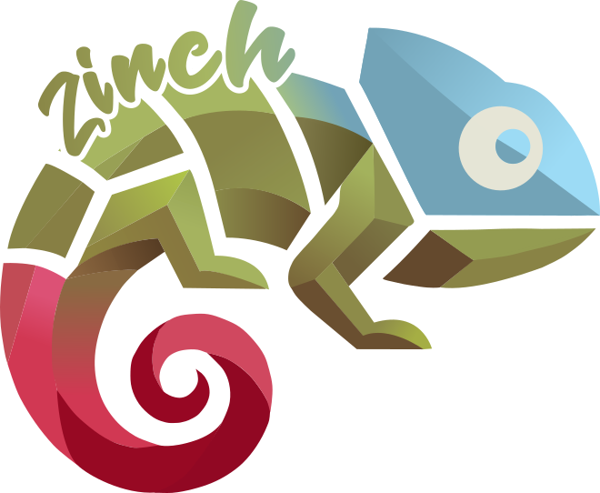

# Zynch by iwai 

  

**Zynch by iwai** es una plataforma SAAS profesional desarrollada por **IWAI - Automated Processes**. Este repositorio contiene el sistema completo "Camaleónico" diseñado para proveedores de servicios personales.

> [!IMPORTANT]
> **Estado Actual: v1.0.0-rc.1 (Latest)**
> Se ha alcanzado la estabilidad en el núcleo del sistema con aislamiento multi-tenant estricto y auditoría de IA activa.

## Estructura del Proyecto
- **** [web-app](./web-app/): La aplicación principal construida con Next.js 16, Tailwind CSS y Convex.
- **** [ai-orchestrator](./ai-orchestrator/): Sistema de agentes de IA para auditoría de seguridad y arquitectura.
- **** [.docs](./.docs/): Documentación técnica y funcional (Sincronizada con GitBook).
- **** [.docs/references](./.docs/references/): Archivos de referencia y benchmarks.
- **** [Email Infrastructure Roadmap](./.docs/saas/roadmap/ZYNCH_EMAIL_IMPLEMENTATION_PLAN.md): Plan completo de implementación multi-tenant con Mailgun, auditoría Convex y casos críticos (recibos, estados de cuenta, verificación).

## Identidad: Zynch by iwai

Zynch está diseñado como una solución de marca blanca ("white label"). Aunque comenzó con implementaciones personalizadas, ha evolucionado hacia una plataforma multi-usuario donde cada "Promotor" o "Performer" puede gestionar su propia identidad de forma aislada:

- **Branding Personalizado**: Paletas de colores y estilos dinámicos por inquilino.
- **Gestión de Citas**: Sistema automatizado de reservaciones y estados.
- **Seguridad de Datos**: Aislamiento estricto de información entre diferentes inquilinos.
- **Galería Multimedia**: Gestión de contenido seguro con procesamiento de imágenes.
- **IA de Auditoría**: Agentes que supervisan la integridad y seguridad del código en tiempo real.

## Documentación (GitBook)

Para guías detalladas, por favor consulte el [Índice de Documentación](./.docs/intro.md).

---
© 2026 **IWAI - Automated Processes** | [www.iwai.work](https://www.iwai.work)
